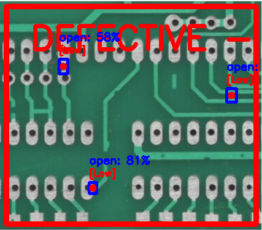
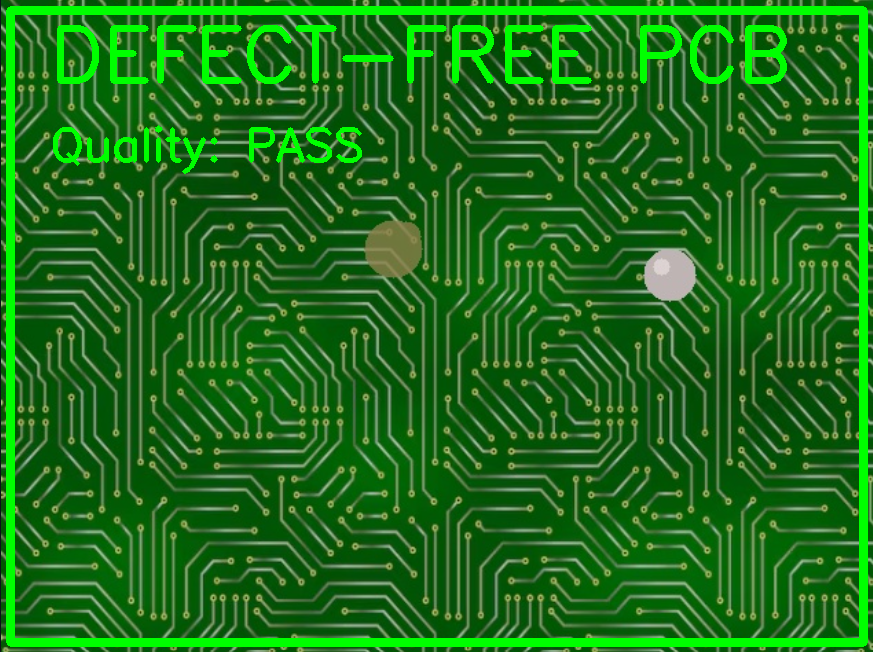

# Automated Quality Inspection System for Manufacturing

Deep learning-based PCB defect detection system using Faster R-CNN. Detects and classifies manufacturing defects with bounding boxes, confidence scores, and severity assessment.


## Overview

This system uses computer vision and deep learning to automatically detect manufacturing defects in printed circuit boards (PCBs). The model identifies four critical defect types:

- **Open Circuit** - Broken electrical connections
- **Short Circuit** - Unwanted electrical connections
- **Mousebite** - Incomplete PCB edge cutting
- **Spur** - Extra copper projections

## Features

✅ Real-time defect detection with bounding boxes  
✅ Classification with confidence scores (85%+ threshold)  
✅ Defect center coordinates (x, y pixels)  
✅ Severity assessment (Low/Medium/High)  
✅ Works on both grayscale and color PCB images  
✅ JSON output format for automation  
✅ Interactive visualization with OpenCV  

## Demo Results

### Defect-Free PCB

*Status: PASS - No defects detected*

### Defective PCBs

*Example 1: Open circuit and mousebite defects detected*


*Example 2: Multiple defects with severity assessment*

### Sample JSON Output
```json
{
  "status": "DEFECTIVE",
  "quality": "FAIL",
  "defect_count": 10,
  "detected_types": ["open", "short", "mousebite", "spur"],
  "defects": [
    {
      "defect_type": "open",
      "confidence": 0.9961,
      "center_x": 565,
      "center_y": 284,
      "severity": "High"
    },
    {
      "defect_type": "mousebite",
      "confidence": 0.9963,
      "center_x": 479,
      "center_y": 455,
      "severity": "Medium"
    }
  ]
}
```
*Full output available in `outputs/detection_defected1.json`*

## Dataset

- **Source:** DeepPCB + MVTec Transistor datasets
- **Total Images:** 2,213 (1,500 defective + 713 normal)
- **Image Size:** 640x640 pixels
- **Annotation Format:** VOC XML
- **Train/Val Split:** 80/20 (1,770 / 443 images)

### Defect Distribution
| Defect Type | Count | Description |
|------------|-------|-------------|
| Open | ~350 | Circuit breaks |
| Short | ~400 | Unwanted connections |
| Mousebite | ~300 | Incomplete cuts |
| Spur | ~450 | Extra copper |

## Model Architecture

- **Base Model:** Faster R-CNN with ResNet-50 FPN backbone
- **Framework:** PyTorch with torchvision
- **Pretrained Weights:** COCO dataset (transfer learning)
- **Number of Classes:** 7 (4 defects + background + 2 filtered)
- **Training Epochs:** 12
- **Batch Size:** 2
- **Optimizer:** SGD (lr=0.005, momentum=0.9)

### Performance Metrics
- **Best Validation Loss:** 0.1287 (Epoch 8)
- **Model Size:** 161 MB
- **Inference Speed:** ~0.3s per image (GPU)

## Installation

### Requirements
- Python 3.8+
- CUDA 12.1+ (for GPU acceleration)
- 4GB+ GPU memory (recommended)

### Setup

```bash
# Clone repository
git clone https://github.com/Gaurav9693089415/AUTOMATED_QUALITY_INSPECTION_SYSTEM_FOR_MANUFACTURING.git
cd AUTOMATED_QUALITY_INSPECTION_SYSTEM_FOR_MANUFACTURING

# Install dependencies
pip install -r requirements.txt
```

## Usage

### 1. Training (Optional - model already trained)

```bash
python train.py
```

**Training configuration:**
- Automatically loads dataset from `data/images/train`
- Saves checkpoints every 5 epochs to `outputs/`
- Tracks best model based on validation loss
- Includes color augmentation for robustness

### 2. Inference

```bash
python inference.py
```

**Interactive mode:**
```
Enter image path (or 'q' to quit):
> path/to/your/pcb_image.jpg
```

**Controls:**
- `ESC` - Process next image
- `Q` - Quit application

### 3. Output Format

**JSON Output (`outputs/detection_*.json`):**
```json
{
  "status": "DEFECTIVE",
  "quality": "FAIL",
  "defect_count": 3,
  "defects": [
    {
      "defect_type": "open",
      "confidence": 0.95,
      "center_x": 320,
      "center_y": 240,
      "bounding_box": {
        "x1": 300,
        "y1": 220,
        "x2": 340,
        "y2": 260
      },
      "severity": "High"
    }
  ]
}
```

**Visual Output:**
- Bounding boxes with color-coded defect types
- Confidence scores displayed on each detection
- Severity labels (Low/Medium/High)
- Overall quality status (PASS/FAIL)

## Project Structure

```
├── data/
│   ├── images/train/          # Training images (2213 total)
│   ├── annotations/train/     # VOC XML annotations
│   └── raw/DeepPCB-master/    # Original dataset
├── src/
│   └── dataset.py             # PyTorch dataset class
├── outputs/
│   ├── best_model.pth         # Best trained model
│   ├── detected_*.png         # Detection results
│   └── detection_*.json       # JSON outputs
├── train.py                   # Training script
├── inference.py               # Inference script
├── requirements.txt           # Dependencies
└── README.md                  # This file
```

## Technical Details

### Data Preprocessing
- Color augmentation (brightness, contrast, saturation, hue)
- Automatic grayscale to RGB conversion
- Image normalization (0-1 range)
- Empty annotations for defect-free images

### Detection Pipeline
1. Load image and convert to RGB tensor
2. Forward pass through Faster R-CNN
3. Filter predictions by confidence threshold (0.85)
4. Keep only 4 critical defect classes
5. Calculate defect centers and severity
6. Draw visualizations and save results

### Severity Assessment
Based on defect area:
- **Low:** < 500 pixels²
- **Medium:** 500-1500 pixels²
- **High:** > 1500 pixels²

## Limitations

- Trained primarily on manufacturing defects (not field aging/corrosion)
- Best performance on images similar to training data style
- May produce false positives on complex via patterns
- Color PCBs: 70-85% accuracy (vs 90-95% on grayscale)

## Future Improvements

- [ ] Add more defect categories (corrosion, contamination)
- [ ] Implement YOLOv8 for faster inference
- [ ] Expand dataset with diverse PCB colors
- [ ] Add instance segmentation for precise defect masks
- [ ] Deploy as REST API for production use

## References

- **DeepPCB Dataset:** [GitHub](https://github.com/tangsanli5201/DeepPCB)
- **MVTec AD Dataset:** [Official Site](https://www.mvtec.com/company/research/datasets/mvtec-ad)
- **Faster R-CNN Paper:** [arXiv:1506.01497](https://arxiv.org/abs/1506.01497)

## License

This project is licensed under the MIT License - see the [LICENSE](LICENSE) file for details.

## Author

**Gaurav Kumar**  
GitHub: [@Gaurav9693089415](https://github.com/Gaurav9693089415)

## Acknowledgments

- DeepPCB dataset creators for providing labeled PCB defect data
- PyTorch team for the excellent deep learning framework
- Anthropic Claude for development assistance

---

**⭐ Star this repo if you find it useful!**